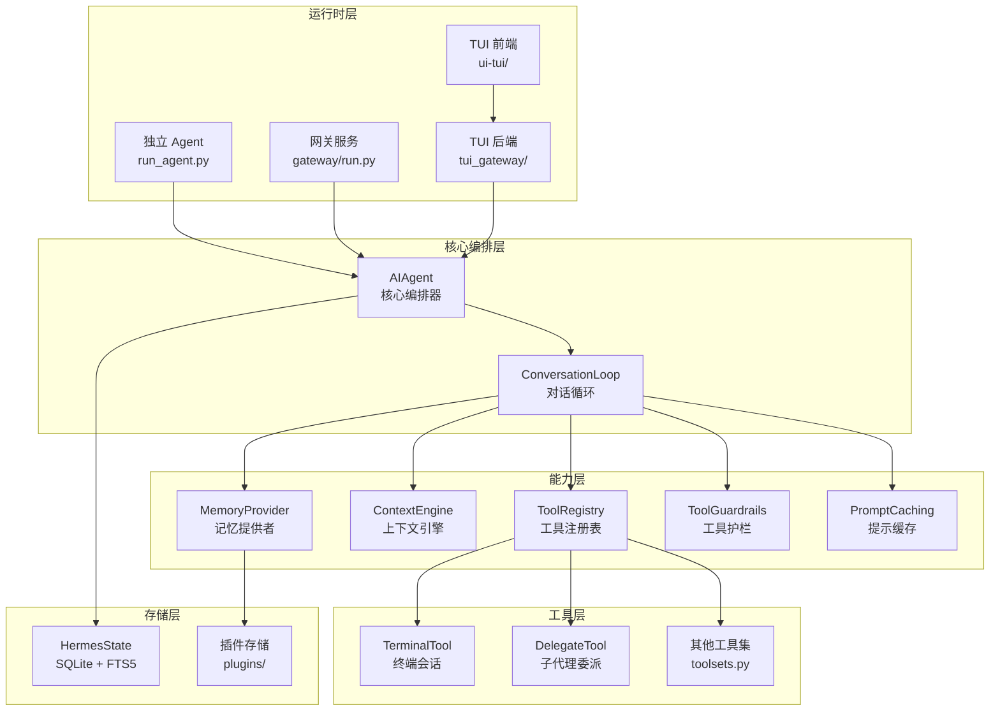
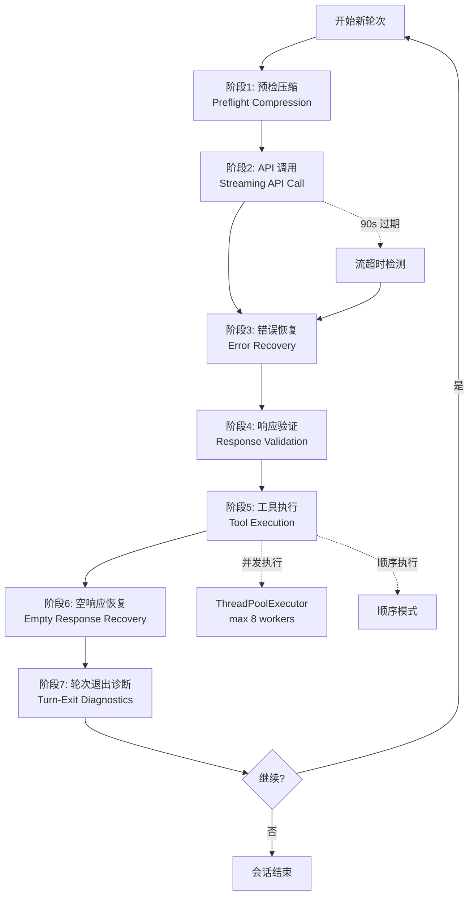
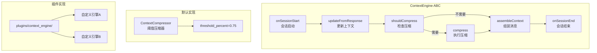
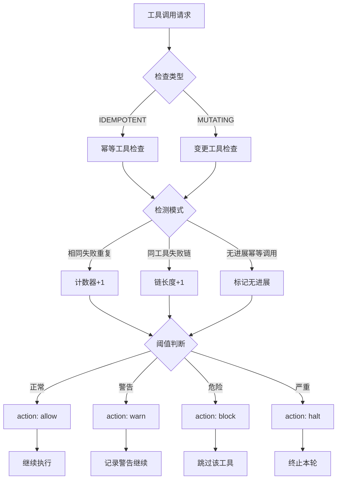
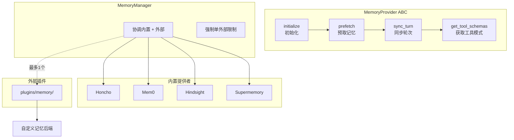
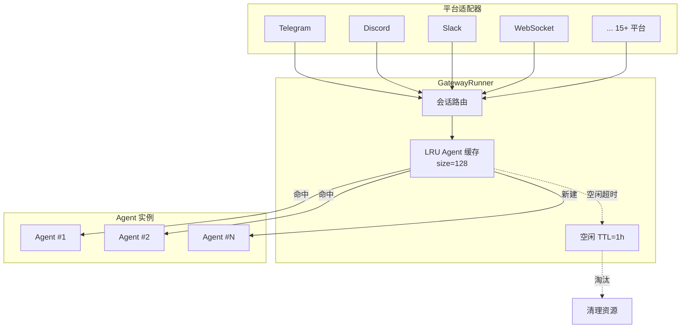

# Hermes Agent 架构文档

本文档描述 Hermes Agent 的系统架构、组件关系和数据流。

---

## 1. 系统总览

Hermes Agent 由三大运行时组成：

| 运行时 | 入口 | 用途 |
|---|---|---|
| **独立 Agent** | `run_agent.py` | 直接运行 AIAgent |
| **网关服务** | `gateway/run.py` | 多平台多会话服务 |
| **TUI** | `ui-tui/` + `tui_gateway/` | Ink/React 终端界面 |



---

## 2. AIAgent 核心编排

`run_agent.py` 中的 `AIAgent` 类是整个系统的中央编排器（~4,309 LOC）。它协调所有子系统完成一次完整的 Agent 运行。


### 初始化参数分类

| 类别 | 示例参数 |
|---|---|
| 模型配置 | `model`, `provider`, `api_key`, `base_url` |
| 上下文管理 | `context_engine`, `max_context_tokens`, `compression_threshold` |
| 记忆配置 | `memory_provider`, `honcho_config`, `mem0_config` |
| 工具配置 | `toolsets`, `blocked_tools`, `tool_timeout` |
| 安全/护栏 | `guardrail_enabled`, `max_iterations`, `iteration_budget` |
| 流式/缓存 | `stream`, `cache_enabled`, `cache_ttl` |
| 网关相关 | `gateway_mode`, `platform_adapter`, `session_ttl` |

---

## 3. 对话循环（Conversation Loop）

`agent/conversation_loop.py`（~4,231 LOC）是 Agent 的核心执行引擎。每轮对话按固定阶段顺序执行：



### 各阶段详解

| 阶段 | 职责 | 关键组件 |
|---|---|---|
| **预检压缩** | 检查上下文是否超限，触发 ContextEngine 压缩 | ContextCompressor |
| **API 调用** | 流式发送请求，注入 cache_control，接收 SSE 流 | PromptCaching |
| **错误恢复** | 按层次处理：编码错误 → 图片拒绝 → 413 → 上下文溢出 → 限流 → 认证失败 | ErrorClassifier, RetryUtils |
| **响应验证** | 校验响应格式、工具调用合法性 | ToolRegistry |
| **工具执行** | 并发/顺序调度工具，传播上下文变量 | ToolExecutor, ThreadPoolExecutor |
| **空响应恢复** | 轻推 → 预填充 → 回退提供者 → 空哨兵 | 内置恢复链 |
| **轮次退出诊断** | 记录本轮指标，更新记忆，触发后台审查 | MemoryManager |

---

## 4. 上下文引擎架构

上下文引擎采用 **ABC + 插件** 模式，允许自定义上下文管理策略。



### ContextCompressor 生命周期

```
onSessionStart() → 初始化上下文窗口
       ↓
updateFromResponse(response) → 将模型响应合并到上下文
       ↓
shouldCompress(context, max_tokens) → 检查是否超过阈值（75%）
       ↓
compress(context) → 丢弃/摘要化早期消息
       ↓
assembleContext() → 生成最终消息列表
       ↓
onSessionEnd() → 清理资源
```

---

## 5. 工具护栏流程

`agent/tool_guardrails.py` 实现**每轮对话级别**的工具调用安全控制，区别于简单的全局循环计数。



### 检测规则

| 规则 | 说明 | 触发条件 |
|---|---|---|
| **相同失败重复** | 同一工具、同一参数、同一错误 | 连续 N 次失败 |
| **同工具失败链** | 同一工具连续失败（参数可能不同） | 连续 M 次 |
| **无进展幂等调用** | 幂等工具返回与之前相同结果 | 连续 K 次无变化 |

### 工具分类

| 分类 | 特征 | 示例 |
|---|---|---|
| **IDEMPOTENT** | 多次调用结果相同，无副作用 | `read_file`, `search`, `get_status` |
| **MUTATING** | 会改变系统状态 | `write_file`, `execute_command`, `delegate_task` |

---

## 6. 记忆提供者架构

记忆系统采用 **ABC + 内置实现 + 外部插件** 的三层架构。



### 关键约束

- **单外部提供者限制**: 同时只能激活一个外部记忆插件，避免冲突
- **生命周期**: `initialize` → `prefetch`（每会话）→ `sync_turn`（每轮）→ `get_tool_schemas`（按需）

---

## 7. 网关架构

`gateway/run.py` 提供多平台、多会话的 Agent 服务能力。



### 网关特性

| 特性 | 实现 |
|---|---|
| Agent 复用 | LRU 缓存，最大 128 个实例 |
| 资源回收 | 1 小时空闲 TTL，自动关闭 |
| 会话隔离 | 每个会话独立 Agent 实例 |
| 平台适配 | 统一接口，15+ 平台实现 |

---

## 8. 工具注册与发现

`tools/registry.py` 实现自注册工具发现机制。

```mermaid
graph TD
    A[模块导入] --> B[AST 扫描]
    B --> C[查找 registry.register() 调用]
    C --> D[提取工具元数据]
    D --> E[注册到 Singleton Registry]
    E --> F[generation 计数器+1]
    F --> G[TTL 缓存 check_fn<br/>30s]

    H[运行时调用] --> I[registry.get]
    I --> J{缓存有效?}
    J -->|是| K[返回缓存]
    J -->|否| L[重新验证]
```

---

## 9. 组件映射表

| 组件 | 文件路径 | 规模 | 职责 |
|---|---|---|---|
| AIAgent | `run_agent.py` | ~4,309 LOC | 核心编排器，协调所有子系统 |
| ConversationLoop | `agent/conversation_loop.py` | ~4,231 LOC | 对话循环的 7 个阶段 |
| HermesState | `hermes_state.py` | ~3,279 LOC | SQLite 会话存储，WAL + FTS5 |
| DelegateTool | `tools/delegate_tool.py` | ~2,801 LOC | 子代理生成与管理 |
| TerminalTool | `tools/terminal_tool.py` | ~2,405 LOC | 终端会话管理 |
| ModelTools | `model_tools.py` | ~923 LOC | 工具编排层 |
| Toolsets | `toolsets.py` | ~876 LOC | 工具集定义与组合 |
| ToolRegistry | `tools/registry.py` | 中等 | 自注册工具发现 |
| ContextEngine | `agent/context_engine.py` | 小 | 上下文引擎 ABC |
| ContextCompressor | `agent/context_compressor.py` | 中等 | 默认上下文压缩实现 |
| ToolGuardrails | `agent/tool_guardrails.py` | 中等 | 每轮工具调用护栏 |
| ToolExecutor | `agent/tool_executor.py` | 中等 | 并发/顺序工具调度 |
| MemoryProvider | `agent/memory_provider.py` | 小 | 记忆提供者 ABC |
| MemoryManager | `agent/memory_manager.py` | 中等 | 记忆 orchestration |
| PromptCaching | `agent/prompt_caching.py` | 中等 | Anthropic cache_control |
| ErrorClassifier | `agent/error_classifier.py` | 小 | 结构化 API 错误分类 |
| RetryUtils | `agent/retry_utils.py` | 小 | 抖动退避工具 |
| GatewayRunner | `gateway/run.py` | 中等 | 网关服务 + LRU 缓存 |
