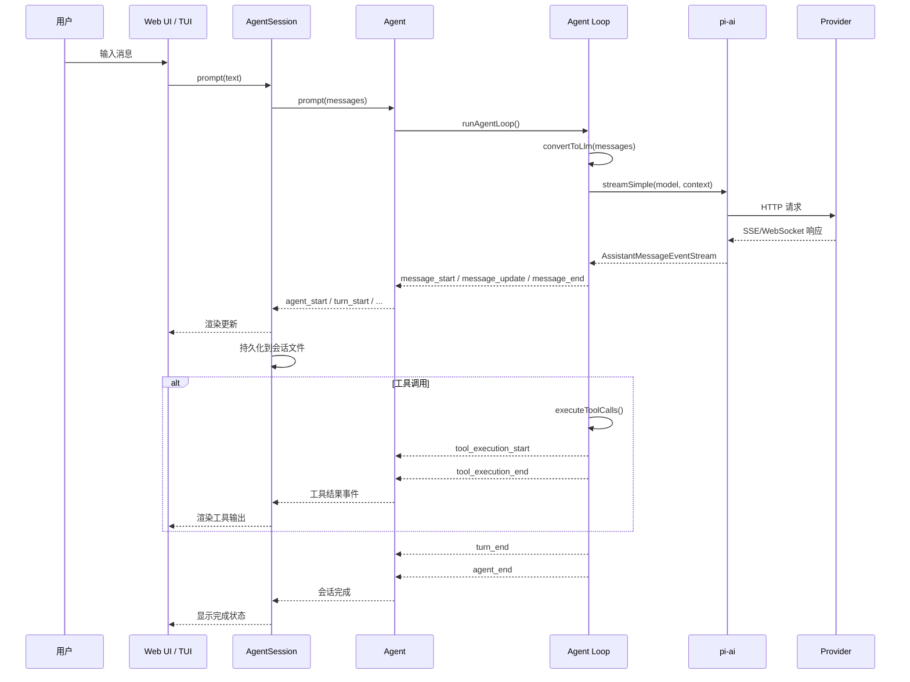
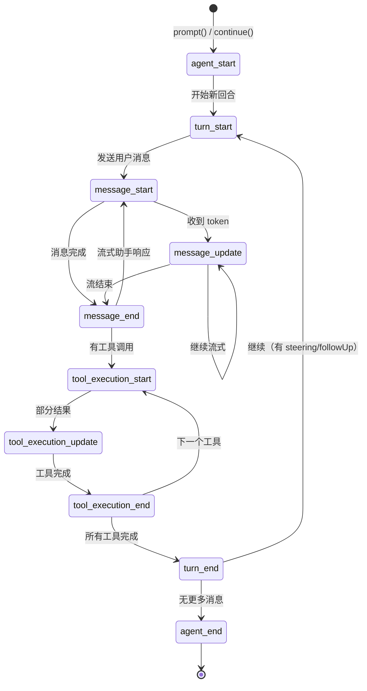
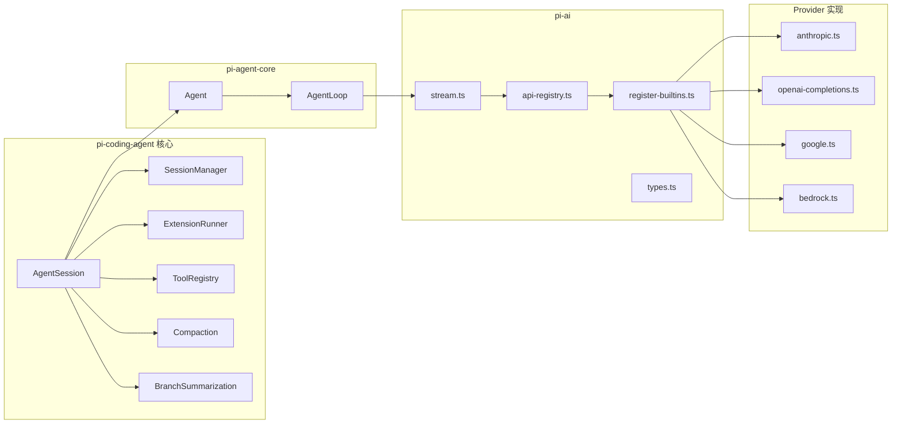
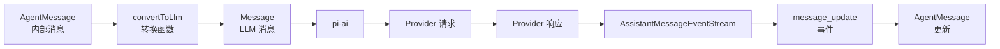
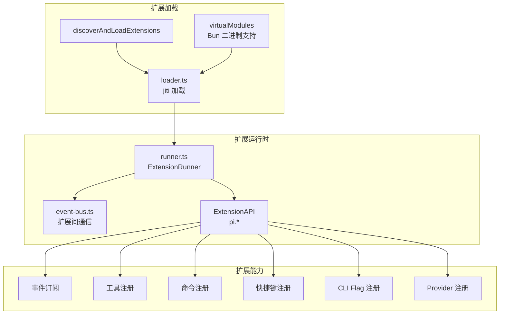
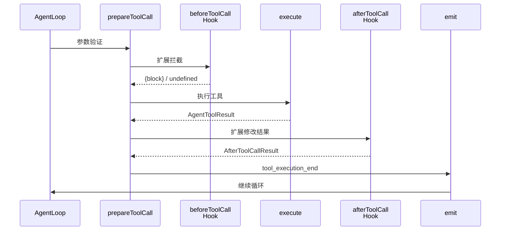

# pi-mono 架构设计

## 1. 五包分层架构

pi-mono 采用严格的分层架构，上层依赖下层，禁止反向依赖。

```mermaid
graph TB
    subgraph "用户界面层"
        W[Web UI<br/>@mariozechner/pi-web-ui]
        T[TUI<br/>@mariozechner/pi-tui]
    end

    subgraph "会话编排层"
        S[AgentSession<br/>@mariozechner/pi-coding-agent]
    end

    subgraph "代理运行时层"
        A[Agent / Agent Loop<br/>@mariozechner/pi-agent-core]
    end

    subgraph "LLM 抽象层"
        AI[pi-ai<br/>@mariozechner/pi-ai]
    end

    subgraph "Provider 实现层"
        P1[OpenAI]
        P2[Anthropic]
        P3[Google]
        P4[Bedrock]
        P5[Mistral]
        P6[...]
    end

    W --> S
    T --> S
    S --> A
    A --> AI
    AI --> P1
    AI --> P2
    AI --> P3
    AI --> P4
    AI --> P5
    AI --> P6
```

### 分层职责

| 层级 | 包 | 职责 |
|------|-----|------|
| 用户界面层 | pi-web-ui / pi-tui | 渲染、输入处理、用户交互 |
| 会话编排层 | pi-coding-agent | 会话管理、扩展系统、工具注册、持久化 |
| 代理运行时层 | pi-agent-core | 消息队列、事件发射、工具执行、LLM 调用协调 |
| LLM 抽象层 | pi-ai | Provider 注册、消息转换、流式协议 |
| Provider 实现层 | 各 Provider 模块 | 具体 API 调用、认证、响应解析 |

## 2. 数据流



## 3. 事件生命周期

Agent 运行时定义了一套完整的事件协议，用于 UI 更新和扩展拦截。



### 事件类型详解

| 事件 | 方向 | 说明 |
|------|------|------|
| `agent_start` | 发射 | 代理运行开始 |
| `agent_end` | 发射 | 代理运行结束，携带新增消息列表 |
| `turn_start` | 发射 | 新回合开始（一次 assistant + tools） |
| `turn_end` | 发射 | 回合结束，携带 assistant 消息和工具结果 |
| `message_start` | 发射 | 消息开始（user/assistant/toolResult） |
| `message_update` | 发射 | 助手消息流式更新 |
| `message_end` | 发射 | 消息完成 |
| `tool_execution_start` | 发射 | 工具开始执行 |
| `tool_execution_update` | 发射 | 工具部分结果（流式） |
| `tool_execution_end` | 发射 | 工具执行完成 |

## 4. 会话树结构

pi-mono 的会话不是线性列表，而是一棵**可分支的树**。

```mermaid
graph TD
    H[SessionHeader<br/>id: session-001] --> M1[User: "Hello"]
    M1 --> M2[Assistant: "Hi!"]
    M2 --> M3[User: "Fix bug"]
    M3 --> M4[Assistant + Tools]
    M4 --> M5[CompactionEntry<br/>summary: "..."]
    M5 --> M6[User: "Refactor"]
    M6 --> M7[Assistant + Tools]

    M4 -.->|分支| B1[BranchSummary<br/>fromId: M4]
    B1 --> M8[User: "Try alt approach"]
    M8 --> M9[Assistant + Tools]

    M7 -.->|导航回 M4| B2[BranchSummary<br/>fromId: M7]
    B2 --> M10[在 M4 继续]
```

### 会话条目类型

| 类型 | 作用 |
|------|------|
| `message` | 标准消息（user/assistant/toolResult） |
| `compaction` | 上下文压缩摘要 |
| `branch_summary` | 分支导航摘要 |
| `custom` | 扩展自定义数据（不参与 LLM 上下文） |
| `custom_message` | 扩展自定义消息（参与 LLM 上下文） |
| `thinking_level_change` | 思考级别变更记录 |
| `model_change` | 模型切换记录 |
| `label` | 用户书签/标记 |
| `session_info` | 会话元数据（名称等） |

### 树操作

- **Fork**：从任意节点创建新分支（新会话文件）
- **Navigate**：在同一会话文件内切换当前叶子节点
- **Branch with Summary**：导航时生成被放弃分支的摘要

## 5. 组件映射



## 6. 关键数据转换点



核心原则：**AgentMessage 在系统内部流转，仅在调用 LLM 时才转换为 Message**。这使得系统可以支持自定义消息类型（如 `bashExecution`、`custom`），而这些类型对 LLM 不可见。

## 7. 扩展系统架构



## 8. 工具执行流程



工具执行支持两种模式：
- **sequential**：逐个执行（有状态依赖时使用）
- **parallel**：预检顺序执行，允许的工具并发执行（默认）
