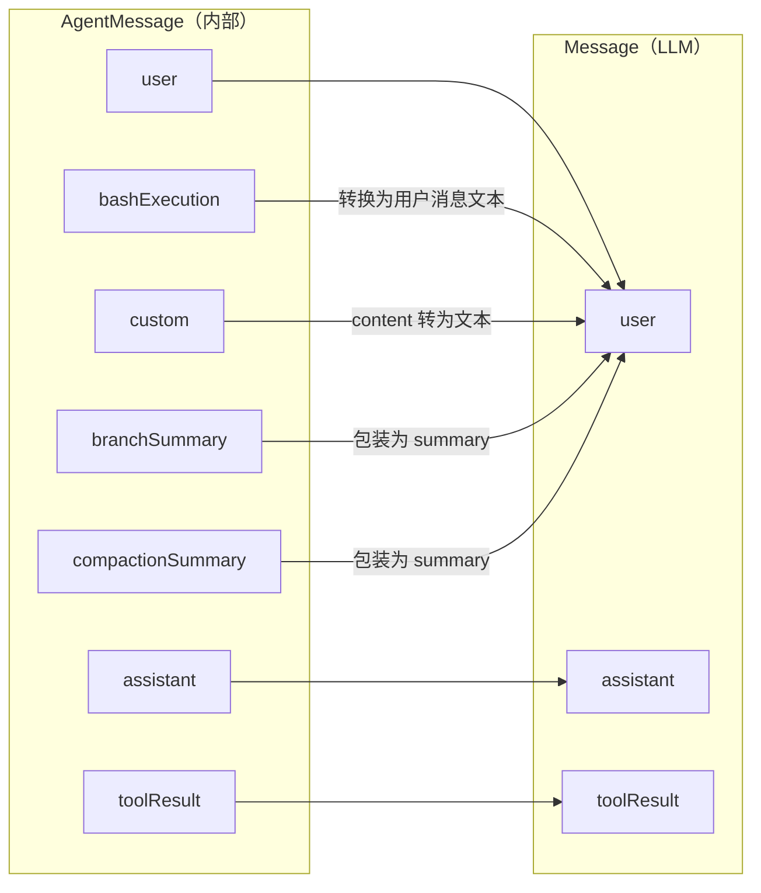
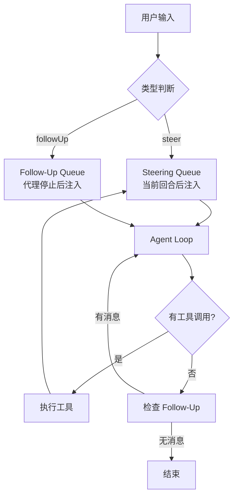
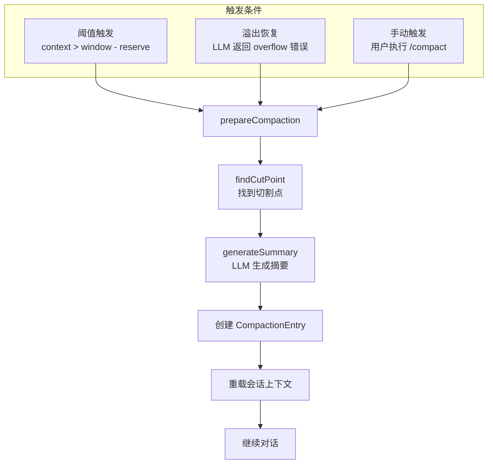
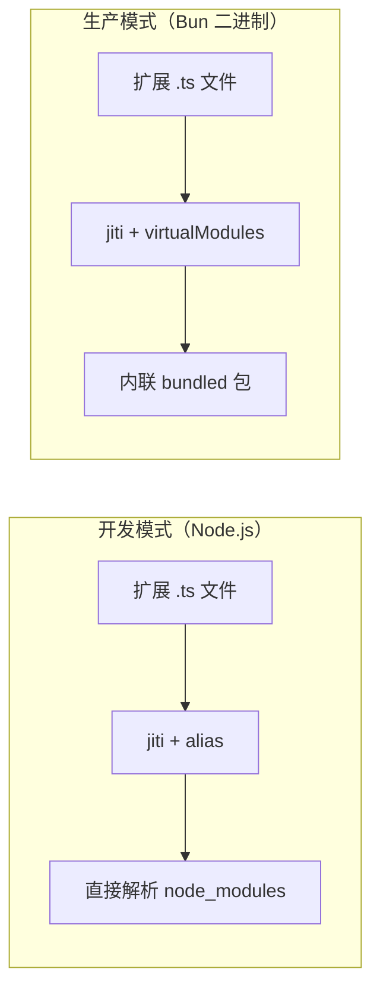
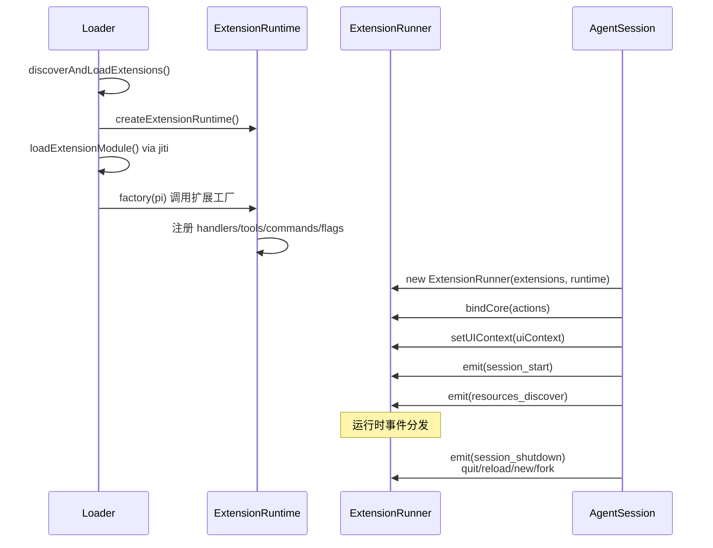

# pi-mono 核心设计决策

## 1. AgentMessage vs Message 分离

### 问题

LLM 消息协议（UserMessage、AssistantMessage、ToolResultMessage）不足以表达编码助手所需的全部内部状态。例如：
- Bash 命令执行记录（`!ls` 的结果）
- 扩展注入的自定义消息
- 分支摘要和压缩摘要
- 用户通过 `!!` 前缀排除的 bash 输出

### 方案

引入 **AgentMessage** 作为内部消息类型，仅在调用 LLM 时通过 `convertToLlm()` 转换为 **Message**。



### 实现：声明合并

通过 TypeScript 声明合并扩展 `CustomAgentMessages` 接口：

```typescript
// packages/coding-agent/src/core/messages.ts
declare module "@earendil-works/pi-agent-core" {
  interface CustomAgentMessages {
    bashExecution: BashExecutionMessage;
    custom: CustomMessage;
    branchSummary: BranchSummaryMessage;
    compactionSummary: CompactionSummaryMessage;
  }
}
```

这使得 `AgentMessage = Message | CustomAgentMessages[keyof CustomAgentMessages]` 可以自动包含自定义类型，同时保持类型安全。

### 好处

1. **类型安全**：自定义消息在编译期有完整类型检查
2. **扩展性**：新消息类型无需修改核心包
3. **清晰的边界**：LLM 无关的内部状态不会泄露到 Provider 层
4. **可过滤**：`convertToLlm()` 可以选择性地排除某些消息（如 `!!` 前缀的 bash）

---

## 2. 队列模式与并发控制

### 问题

用户可能在代理运行时发送新消息。如何处理这些"中途"输入？

### 方案：双队列系统



### Steering vs Follow-Up

| 特性 | Steering | Follow-Up |
|------|----------|-----------|
| 注入时机 | 当前回合工具执行完成后 | 代理即将停止时 |
| 用途 | 纠正/引导正在工作的代理 | 后续跟进问题 |
| 优先级 | 高（先检查） | 低（后检查） |
| 典型场景 | "用 Promise 替代回调" | "再优化一下性能" |

### 队列模式

```typescript
type QueueMode = "all" | "one-at-a-time";
```

- `"all"`：一次排空所有队列消息（适合批量处理）
- `"one-at-a-time"`：每次只处理一条（默认，适合交互式对话）

### 并发安全

Agent 类通过 `ActiveRun` 跟踪当前运行状态：

```typescript
type ActiveRun = {
  promise: Promise<void>;
  resolve: () => void;
  abortController: AbortController;
};
```

- 同一时间只有一个 `ActiveRun`
- `prompt()` 和 `continue()` 检查 `activeRun`，若存在则抛出错误
- `abort()` 触发 `AbortController`，信号传播到所有异步操作

---

## 3. 上下文压缩策略

### 问题

长会话会超出 LLM 上下文窗口，导致请求失败或成本激增。

### 方案：三级压缩机制



### 切割点算法

1. 从最新消息反向遍历，累积 token 估计
2. 达到 `keepRecentTokens` 预算时停止
3. 在有效的切割位置（user/assistant/custom/bashExecution）截断
4. 从不切割 toolResult（必须跟随其 toolCall）

### 处理跨回合切割

若切割点位于回合中间（如 assistant 消息有 tool calls）：
- 保留完整回合的最近部分
- 对切割点之前的回合前缀生成单独摘要
- 最终摘要 = 历史摘要 + "---" + 回合前缀摘要

### 压缩设置

```typescript
interface CompactionSettings {
  enabled: boolean;       // 是否启用自动压缩
  reserveTokens: number;  // 保留空间（默认 16384）
  keepRecentTokens: number; // 保留的最近消息（默认 20000）
}
```

### 溢出恢复

当 LLM 返回上下文溢出错误时：
1. 移除错误消息（保留在会话文件中，但从代理状态删除）
2. 执行自动压缩
3. 压缩完成后自动 `continue()` 重试
4. 仅尝试一次，再次失败则报告错误

---

## 4. 扩展系统

### 设计目标

- 支持 TypeScript 扩展，无需预编译
- 扩展可以使用 pi 的内部包（pi-ai、pi-agent-core、pi-tui）
- 支持 Bun 编译为二进制后的扩展加载
- 扩展生命周期与会话绑定

### 加载机制：jiti + 虚拟模块



### 虚拟模块映射

```typescript
const VIRTUAL_MODULES: Record<string, unknown> = {
  "typebox": _bundledTypebox,
  "@sinclair/typebox": _bundledTypebox,
  "@earendil-works/pi-agent-core": _bundledPiAgentCore,
  "@earendil-works/pi-tui": _bundledPiTui,
  "@earendil-works/pi-ai": _bundledPiAi,
  "@earendil-works/pi-ai/oauth": _bundledPiAiOauth,
  "@earendil-works/pi-coding-agent": _bundledPiCodingAgent,
};
```

### 发现规则

扩展从以下位置自动发现：

1. **项目本地**：`cwd/.pi/extensions/*`
   - `.ts`/`.js` 文件直接加载
   - 子目录含 `index.ts` 或 `package.json`（含 `pi.extensions` 字段）则加载
2. **全局**：`~/.pi/extensions/*`（同上规则）
3. **显式配置**：通过 CLI 参数或配置指定的路径

### 生命周期



### 运行时替换安全

扩展上下文在会话替换（newSession/fork/switchSession/reload）后会失效：

```typescript
const assertActive = () => {
  if (state.staleMessage) {
    throw new Error(state.staleMessage);
  }
};
```

所有 API 方法在调用前检查 `assertActive()`，防止扩展在失效上下文上操作。

---

## 5. 工具 Operations 模式

### 问题

内置工具（如 bash）需要支持远程执行场景（如 SSH 到远程服务器）。

### 方案：可插拔 Operations

```typescript
export interface BashOperations {
  exec: (
    command: string,
    cwd: string,
    options: {
      onData: (data: Buffer) => void;
      signal?: AbortSignal;
      timeout?: number;
      env?: NodeJS.ProcessEnv;
    },
  ) => Promise<{ exitCode: number | null }>;
}

// 本地执行
export function createLocalBashOperations(options?: { shellPath?: string }): BashOperations;
```

### 使用方式

```typescript
// 默认：本地执行
const localOps = createLocalBashOperations();

// 扩展可覆盖：远程执行
const sshOps: BashOperations = {
  exec: async (command, cwd, options) => {
    // 通过 SSH 在远程执行
    const result = await sshExec(command, remoteHost);
    return { exitCode: result.exitCode };
  },
};

// 在 AgentSession 中覆盖
new AgentSession({
  ...,
  baseToolsOverride: {
    bash: createBashTool(sshOps),
  },
});
```

### 好处

1. **单一工具定义**：工具逻辑（参数验证、结果格式化）与执行机制分离
2. **测试友好**：可以注入 mock operations
3. **远程支持**：无需修改工具定义即可支持远程执行

---

## 6. Thinking Levels 抽象

### 问题

不同 Provider 对"思考/推理"的 API 参数不同：
- OpenAI: `reasoning_effort: "low" | "medium" | "high"`
- Anthropic: `thinking: { type: "enabled", budget_tokens: number }`
- Google: `thinking: { includeThoughts: boolean }`
- DeepSeek: `thinking: { type: "enabled" }` + `reasoning_effort`

### 方案：统一级别 + Provider 映射

```typescript
export type ThinkingLevel = "off" | "minimal" | "low" | "medium" | "high" | "xhigh";

interface Model<TApi extends Api> {
  reasoning: boolean;
  thinkingLevelMap?: ThinkingLevelMap;  // 级别到 Provider 值的映射
}

type ThinkingLevelMap = Partial<Record<ModelThinkingLevel, string | null>>;
```

### 映射示例

```typescript
// Claude 4 Sonnet
{
  reasoning: true,
  thinkingLevelMap: {
    off: null,           // null = 不支持
    minimal: "low",
    low: "low",
    medium: "medium",
    high: "high",
    xhigh: null,         // 此模型不支持 xhigh
  }
}
```

### Token 预算

```typescript
export interface ThinkingBudgets {
  minimal?: number;
  low?: number;
  medium?: number;
  high?: number;
}
```

Provider 将 thinking level 转换为具体的 token 预算（仅支持 token-based 的 Provider）。

### 能力检测

```typescript
function getSupportedThinkingLevels(model: Model<any>): ModelThinkingLevel[] {
  if (!model.reasoning) return ["off"];
  const levels: ModelThinkingLevel[] = ["off"];
  const allLevels: ThinkingLevel[] = ["minimal", "low", "medium", "high", "xhigh";
  for (const level of allLevels) {
    if (model.thinkingLevelMap?.[level] !== null) {
      levels.push(level);
    }
  }
  return levels;
}
```

---

## 7. Lockstep Versioning

### 设计

所有 5 个包共享同一个版本号。每次发布时，所有包一起更新版本。

```
pi-mono v0.72.0
├── @earendil-works/pi-ai@0.72.0
├── @earendil-works/pi-agent-core@0.72.0
├── @earendil-works/pi-coding-agent@0.72.0
├── @earendil-works/pi-tui@0.72.0
└── @earendil-works/pi-web-ui@0.72.0
```

### 原因

1. **包间耦合紧密**：pi-coding-agent 依赖特定版本的 pi-agent-core，版本不同步会导致运行时错误
2. **减少认知负担**：用户只需记住一个版本号
3. **原子发布**：一次发布即一个完整可用的系统快照
4. **简化问题定位**：报告问题时只需提供单个版本号

### 实现

根目录的 `package.json` 定义统一版本，各子包通过 workspace 协议引用：

```json
{
  "name": "pi-mono",
  "version": "0.72.0",
  "workspaces": ["packages/*"]
}
```

子包内部依赖：

```json
{
  "dependencies": {
    "@earendil-works/pi-agent-core": "workspace:*",
    "@earendil-works/pi-ai": "workspace:*"
  }
}
```

---

## 8. 关键设计原则总结

| 原则 | 体现 |
|------|------|
| **分层隔离** | Web UI/TUI -> AgentSession -> Agent -> pi-ai -> Provider |
| **事件驱动** | 所有状态变更通过事件传播，UI 和扩展订阅事件 |
| **类型安全** | TypeBox 运行时验证 + TypeScript 编译时检查 |
| **可扩展性** | 声明合并、扩展系统、工具 operations 模式 |
| **持久化透明** | 会话树自动保存，导航/压缩不丢失历史 |
| **失败隔离** | 扩展错误不崩溃主程序，工具错误编码为结果 |
| **Provider 无关** | thinking levels、缓存、传输等概念统一抽象 |
