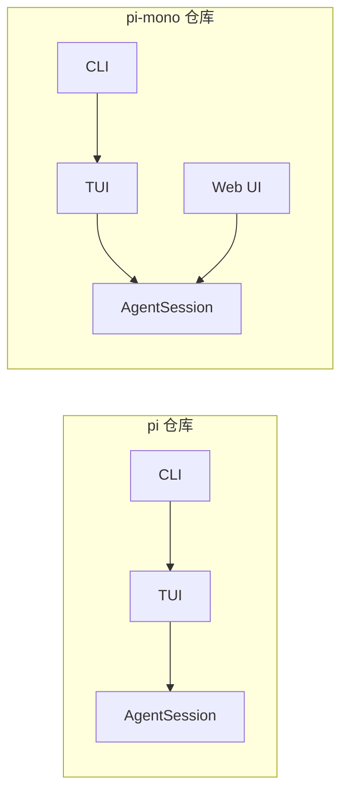

# pi-mono 源码目录指引说明

本文档帮助新开发者快速定位 pi-mono 各源码文件的位置和职责。

## 源码树总览

```
pi-mono/
├── package.json                  # Root monorepo config
├── tsconfig.base.json
├── biome.json
└── packages/
    ├── ai/
    │   ├── src/
    │   │   ├── index.ts
    │   │   ├── stream.ts
    │   │   ├── types.ts
    │   │   ├── api-registry.ts
    │   │   ├── models.ts
    │   │   ├── models.generated.ts
    │   │   ├── providers/
    │   │   │   ├── register-builtins.ts
    │   │   │   ├── anthropic.ts
    │   │   │   ├── openai-responses.ts
    │   │   │   └── ... (25+ providers)
    │   │   └── utils/
    │   │       └── event-stream.ts
    │   └── test/
    ├── agent/
    │   ├── src/
    │   │   ├── index.ts
    │   │   ├── agent.ts          # Agent class
    │   │   ├── agent-loop.ts     # Core loop
    │   │   └── types.ts          # Core types
    │   └── test/
    ├── coding-agent/
    │   ├── src/
    │   │   ├── index.ts
    │   │   ├── main.ts
    │   │   ├── cli/              # CLI parsing, config
    │   │   ├── core/
    │   │   │   ├── agent-session.ts       # Central orchestrator (3108 lines)
    │   │   │   ├── session-manager.ts     # Persistence
    │   │   │   ├── sdk.ts                 # Public SDK
    │   │   │   ├── extensions/
    │   │   │   │   ├── types.ts           # Extension API
    │   │   │   │   ├── runner.ts          # Event dispatch
    │   │   │   │   └── loader.ts          # jiti loading
    │   │   │   ├── compaction/
    │   │   │   │   ├── compaction.ts
    │   │   │   │   └── branch-summarization.ts
    │   │   │   └── tools/
    │   │   │       ├── index.ts
    │   │   │       ├── bash.ts
    │   │   │       ├── read.ts
    │   │   │       ├── edit.ts
    │   │   │       └── ...
    │   │   ├── modes/
    │   │   │   ├── interactive/
    │   │   │   ├── print/
    │   │   │   └── rpc/
    │   │   └── utils/
    │   └── test/
    ├── tui/
    │   ├── src/
    │   │   ├── index.ts
    │   │   ├── tui.ts            # Main TUI
    │   │   ├── terminal.ts
    │   │   └── components/
    │   │       ├── editor.ts
    │   │       ├── markdown.ts
    │   │       └── ...
    │   └── test/
    └── web-ui/                   # NEW vs pi repo
        ├── src/
        │   ├── ChatPanel.ts
        │   ├── components/
        │   │   ├── AgentInterface.ts
        │   │   └── Messages.ts
        │   └── ...
        └── test/
```

---

## 文件职责表（按功能分组）

### LLM 抽象层（packages/ai/）

| 文件 | 职责 | 代码量 |
|------|------|--------|
| `src/index.ts` | 包入口，导出公共 API | ~50 行 |
| `src/stream.ts` | 统一流式接口：`stream()`、`streamSimple()`、`complete()`、`completeSimple()` | ~400 行 |
| `src/types.ts` | 核心类型定义：`Model`、`Api`、`Context`、`Message`、`Tool` 等 | ~300 行 |
| `src/api-registry.ts` | Provider API 注册表，懒加载管理 | ~200 行 |
| `src/models.ts` | 模型定义（手动维护的模型列表） | ~500 行 |
| `src/models.generated.ts` | 模型定义（自动生成的完整列表） | ~2000 行 |
| `src/providers/register-builtins.ts` | 注册所有内置 Provider | ~100 行 |
| `src/providers/anthropic.ts` | Anthropic Provider 实现 | ~600 行 |
| `src/providers/openai-responses.ts` | OpenAI Responses API 实现 | ~500 行 |
| `src/providers/*.ts` | 其他 25+ Provider 实现 | 各 200-800 行 |
| `src/utils/event-stream.ts` | EventStream 类实现（异步迭代器协议） | ~150 行 |

### 代理运行时层（packages/agent/）

| 文件 | 职责 | 代码量 |
|------|------|--------|
| `src/index.ts` | 包入口 | ~30 行 |
| `src/agent.ts` | `Agent` 类：状态管理、队列 API、事件订阅、并发控制 | ~400 行 |
| `src/agent-loop.ts` | `runAgentLoop()` / `runAgentLoopContinue()`：核心执行循环、工具调用编排、流式响应处理 | ~600 行 |
| `src/types.ts` | Agent 核心类型：`AgentMessage`、`AgentEvent`、`AgentTool`、`AgentState` 等 | ~300 行 |

### 会话编排层（packages/coding-agent/）

| 文件 | 职责 | 代码量 |
|------|------|--------|
| `src/index.ts` | 包入口 | ~50 行 |
| `src/main.ts` | CLI 入口，模式分发 | ~200 行 |
| `src/cli/*.ts` | CLI 参数解析、配置加载、命令处理 | ~800 行 |
| `src/core/agent-session.ts` | **中央编排器**：会话状态管理、事件桥接、模型/工具/压缩/扩展协调 | ~3100 行 |
| `src/core/session-manager.ts` | 会话树持久化、文件读写、条目管理 | ~800 行 |
| `src/core/sdk.ts` | 公共 SDK 接口，供扩展使用 | ~300 行 |
| `src/core/extensions/types.ts` | ExtensionAPI 类型定义（`pi.*` 接口） | ~600 行 |
| `src/core/extensions/runner.ts` | `ExtensionRunner`：事件分发、生命周期管理 | ~500 行 |
| `src/core/extensions/loader.ts` | 扩展发现与 jiti 加载、虚拟模块 | ~400 行 |
| `src/core/compaction/compaction.ts` | 上下文压缩逻辑：切割点算法、摘要生成 | ~600 行 |
| `src/core/compaction/branch-summarization.ts` | 分支导航时的摘要生成 | ~400 行 |
| `src/core/tools/index.ts` | 工具注册表、工具集合 | ~200 行 |
| `src/core/tools/bash.ts` | Bash 工具实现（含 Operations 模式） | ~400 行 |
| `src/core/tools/read.ts` | Read 工具实现 | ~200 行 |
| `src/core/tools/edit.ts` | Edit 工具实现 | ~300 行 |
| `src/core/tools/write.ts` | Write 工具实现 | ~150 行 |
| `src/modes/interactive/*.ts` | 交互式 TUI 模式 | ~1500 行 |
| `src/modes/print/*.ts` | 打印模式（非交互式） | ~300 行 |
| `src/modes/rpc/*.ts` | RPC 模式（tmux-bridge 等） | ~500 行 |
| `src/utils/*.ts` | 通用工具函数 | ~600 行 |

### 终端 UI 层（packages/tui/）

| 文件 | 职责 | 代码量 |
|------|------|--------|
| `src/index.ts` | 包入口 | ~30 行 |
| `src/tui.ts` | `TUI` 主类：差分渲染引擎、布局管理 | ~800 行 |
| `src/terminal.ts` | 终端底层操作（光标、颜色、尺寸） | ~400 行 |
| `src/components/editor.ts` | 编辑器组件：撤销、自动补全、语法高亮 | ~600 行 |
| `src/components/markdown.ts` | Markdown 渲染组件 | ~400 行 |
| `src/components/*.ts` | 其他 UI 组件（面板、列表、输入框等） | 各 200-500 行 |

### Web UI 层（packages/web-ui/）

| 文件 | 职责 | 代码量 |
|------|------|--------|
| `src/index.ts` | 包入口 | ~30 行 |
| `src/ChatPanel.ts` | 聊天面板主组件 | ~500 行 |
| `src/components/AgentInterface.ts` | 代理界面组件 | ~400 行 |
| `src/components/Messages.ts` | 消息列表渲染 | ~300 行 |
| `src/components/*.ts` | 其他 Web 组件（Artifact 渲染、工具输出等） | 各 200-600 行 |

---

## 新开发者阅读路径

### 路径一：理解整体架构（30 分钟）

```
1. packages/agent/src/types.ts          -> 了解核心类型
2. packages/agent/src/agent-loop.ts     -> 理解执行循环
3. packages/coding-agent/src/core/agent-session.ts（前 500 行）-> 理解编排逻辑
4. packages/ai/src/stream.ts            -> 理解 LLM 流式接口
```

### 路径二：实现新 Provider（1 小时）

```
1. packages/ai/src/types.ts             -> 理解 Model/Api 类型
2. packages/ai/src/providers/anthropic.ts -> 参考现有实现
3. packages/ai/src/providers/register-builtins.ts -> 了解注册方式
4. packages/ai/src/models.ts            -> 添加模型定义
```

### 路径三：开发扩展（1 小时）

```
1. packages/coding-agent/src/core/extensions/types.ts -> 理解 ExtensionAPI
2. packages/coding-agent/src/core/sdk.ts              -> 了解 SDK 接口
3. packages/coding-agent/src/core/extensions/runner.ts -> 理解事件分发
4. 参考 ~/.pi/extensions/ 或 examples/ 中的扩展示例
```

### 路径四：调试工具执行（30 分钟）

```
1. packages/coding-agent/src/core/tools/index.ts      -> 工具注册
2. packages/coding-agent/src/core/tools/bash.ts       -> 工具实现示例
3. packages/agent/src/agent-loop.ts（工具执行部分）    -> 调用流程
4. packages/coding-agent/src/core/agent-session.ts（工具相关事件）-> 事件桥接
```

### 路径五：理解压缩机制（45 分钟）

```
1. packages/coding-agent/src/core/compaction/compaction.ts -> 压缩逻辑
2. packages/coding-agent/src/core/compaction/branch-summarization.ts -> 分支摘要
3. packages/coding-agent/src/core/session-manager.ts（条目管理）-> 持久化结构
4. packages/agent/src/agent.ts（队列/状态管理）-> 代理状态交互
```

---

## 与 pi 仓库的差异

pi-mono 是原始 pi 仓库的 monorepo 重构版本，主要差异如下：

| 方面 | pi（旧） | pi-mono（新） |
|------|---------|--------------|
| 结构 | 单体仓库，单包 | Monorepo，5 个独立包 |
| Web UI | 无 | 新增 `packages/web-ui/` |
| 包边界 | 模糊，循环依赖风险 | 清晰分层，禁止反向依赖 |
| 扩展加载 | 直接 require | jiti + 虚拟模块（支持 Bun 二进制） |
| 版本管理 | 单版本 | Lockstep 同步版本 |
| 可复用性 | 只能整体使用 | 可单独使用 pi-ai、pi-agent-core |

### 新增包：web-ui

`packages/web-ui/` 是 pi-mono 相对于 pi 仓库的全新包：

- 基于 **Lit** 的 Web Components
- 提供浏览器端的聊天界面
- 支持 Artifact 渲染（HTML、Markdown、PDF、Excel 等）
- 使用 IndexedDB 进行客户端持久化
- 与 pi-tui 共享同一套 AgentSession 后端



---

## 快速参考："如果你想理解 X，读 Y"

| 你想理解 | 读这些文件 |
|---------|-----------|
| **Agent 执行循环** | `packages/agent/src/agent-loop.ts` |
| **消息类型系统** | `packages/agent/src/types.ts` |
| **Agent 状态管理** | `packages/agent/src/agent.ts` |
| **会话编排（中央大脑）** | `packages/coding-agent/src/core/agent-session.ts` |
| **会话持久化/树结构** | `packages/coding-agent/src/core/session-manager.ts` |
| **扩展 API** | `packages/coding-agent/src/core/extensions/types.ts` |
| **扩展加载机制** | `packages/coding-agent/src/core/extensions/loader.ts` |
| **事件分发** | `packages/coding-agent/src/core/extensions/runner.ts` |
| **上下文压缩** | `packages/coding-agent/src/core/compaction/compaction.ts` |
| **分支摘要** | `packages/coding-agent/src/core/compaction/branch-summarization.ts` |
| **Bash 工具** | `packages/coding-agent/src/core/tools/bash.ts` |
| **工具注册** | `packages/coding-agent/src/core/tools/index.ts` |
| **LLM 流式接口** | `packages/ai/src/stream.ts` |
| **Provider 实现模式** | `packages/ai/src/providers/anthropic.ts` |
| **模型定义** | `packages/ai/src/models.ts` |
| **TUI 渲染引擎** | `packages/tui/src/tui.ts` |
| **终端编辑器组件** | `packages/tui/src/components/editor.ts` |
| **Web UI 聊天面板** | `packages/web-ui/src/ChatPanel.ts` |
| **CLI 入口** | `packages/coding-agent/src/main.ts` |
| **SDK 公共接口** | `packages/coding-agent/src/core/sdk.ts` |
| **EventStream 协议** | `packages/ai/src/utils/event-stream.ts` |
| **TypeBox 工具定义** | `packages/coding-agent/src/core/tools/read.ts` |
| **声明合并扩展消息** | `packages/coding-agent/src/core/messages.ts` |
| **Thinking Levels** | `packages/ai/src/types.ts`（`ThinkingLevel` 类型） |
| **Operations 模式** | `packages/coding-agent/src/core/tools/bash.ts`（`BashOperations` 接口） |
