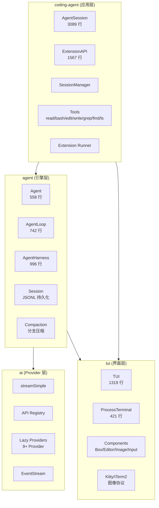
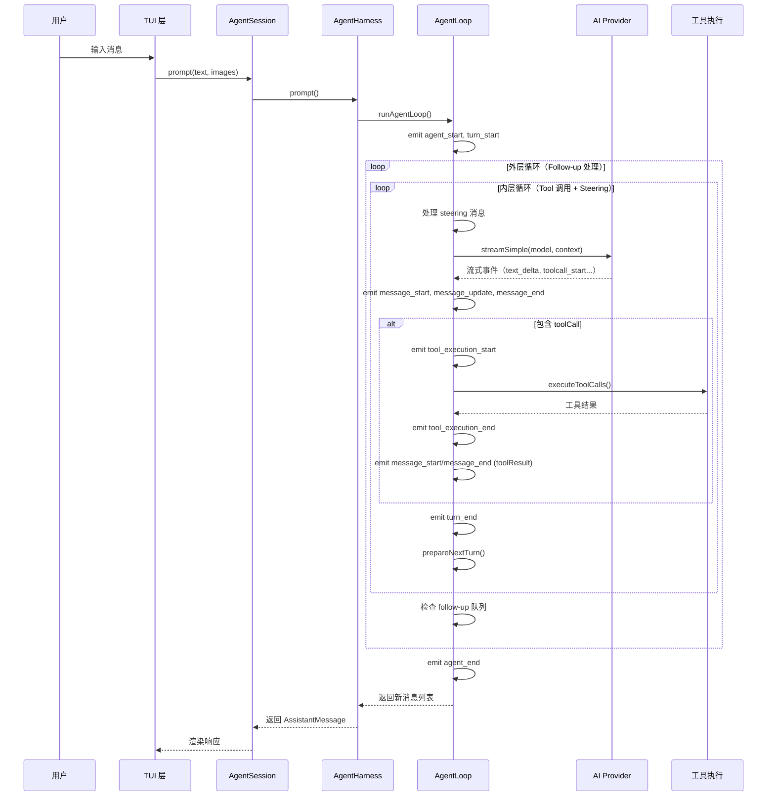
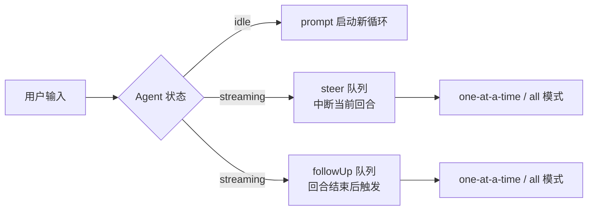
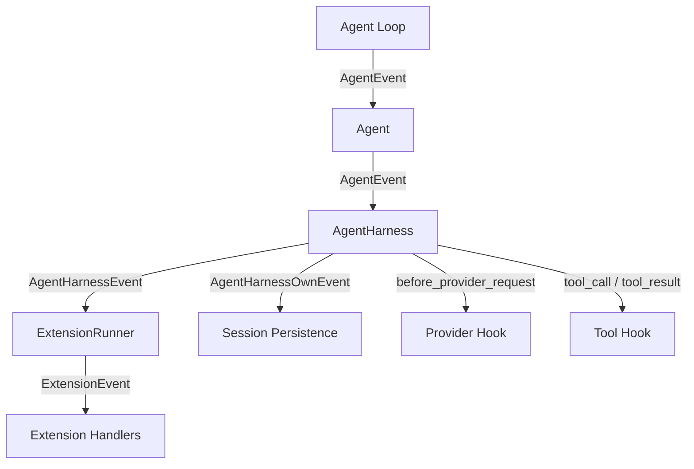
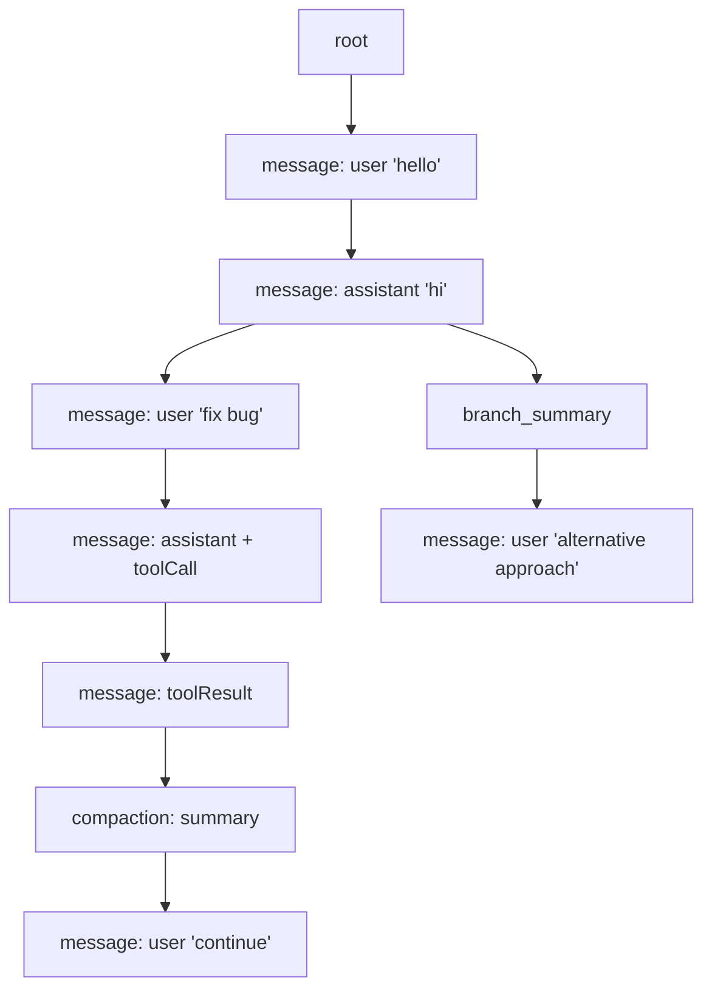

# Pi Agent Harness 架构

## 分层架构

## 数据流：Agent 循环

## 组件映射表

| 层级 | 组件 | 文件 | 职责 |
|------|------|------|------|
| 应用层 | `AgentSession` | `coding-agent/src/core/agent-session.ts` | 会话生命周期、事件订阅、自动压缩、重试逻辑 |
| 应用层 | `ExtensionRunner` | `coding-agent/src/core/extensions/runner.ts` | 扩展加载、事件分发、API 绑定 |
| 应用层 | `SessionManager` | `coding-agent/src/core/session-manager.ts` | JSONL 文件读写、会话树导航 |
| 引擎层 | `Agent` | `agent/src/agent.ts` | 状态包装、事件订阅、队列管理 |
| 引擎层 | `AgentLoop` | `agent/src/agent-loop.ts` | 核心循环逻辑、流式响应、工具执行 |
| 引擎层 | `AgentHarness` | `agent/src/harness/agent-harness.ts` | 阶段管理、事件钩子、会话持久化 |
| 引擎层 | `Session` | `agent/src/harness/session/session.ts` | 会话上下文构建、entry 追加 |
| Provider 层 | `streamSimple` | `ai/src/stream.ts` | 统一流式调用入口 |
| Provider 层 | `ApiRegistry` | `ai/src/api-registry.ts` | Provider 注册表 |
| Provider 层 | `EventStream` | `ai/src/utils/event-stream.ts` | 通用异步事件流 |
| 界面层 | `TUI` | `tui/src/tui.ts` | 差分渲染、叠加层、焦点管理 |
| 界面层 | `ProcessTerminal` | `tui/src/terminal.ts` | 原始模式、Kitty 协议、输入缓冲 |

## 核心循环详解

### 内层循环（Inner Loop）

处理单个 Agent "回合"（turn），包含以下步骤：

1. **Steering 消息注入**：从 steering 队列中取出消息注入上下文
2. **LLM 流式响应**：调用 `streamAssistantResponse()`，将 `AgentMessage[]` 转换为 `Message[]` 后发送给 Provider
3. **Tool 调用执行**：如果响应包含 `toolCall`，进入 `executeToolCalls()`
4. **Turn 结束**：emit `turn_end` 事件
5. **准备下一回合**：调用 `prepareNextTurn()` 更新上下文/模型/思考级别

### 外层循环（Outer Loop）

当内层循环结束（无更多 toolCall、无 steering 消息）时：

1. 检查 follow-up 队列
2. 如有 follow-up 消息，将其设为 pending，继续内层循环
3. 如无消息，emit `agent_end`，循环结束

### 队列机制

| 队列 | 用途 | 触发时机 |
|------|------|---------|
| `steer` | 用户在中途输入的消息 | 当前 assistant 回合结束后注入 |
| `followUp` | 用户预置的后续消息 | Agent 将要停止时注入 |
| `nextTurn` | 下一回合的初始消息 | 下一回合开始时注入 |

## 事件流架构

## 会话树结构

会话树 entry 类型：

| 类型 | 说明 |
|------|------|
| `message` | 对话消息（user/assistant/toolResult） |
| `thinking_level_change` | 思考级别变更 |
| `model_change` | 模型切换 |
| `compaction` | 历史压缩摘要 |
| `branch_summary` | 分支导航摘要 |
| `custom` | 扩展自定义数据 |
| `custom_message` | 扩展自定义消息（可参与上下文） |
| `label` | 用户书签标签 |
| `session_info` | 会话元数据（名称等） |
| `leaf` | 当前活跃叶子节点指针 |
