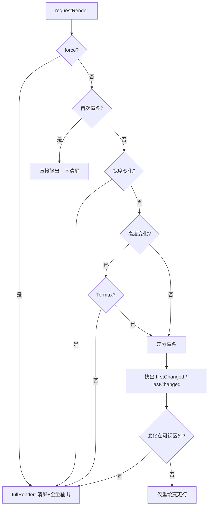
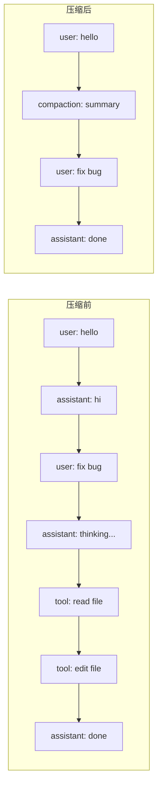
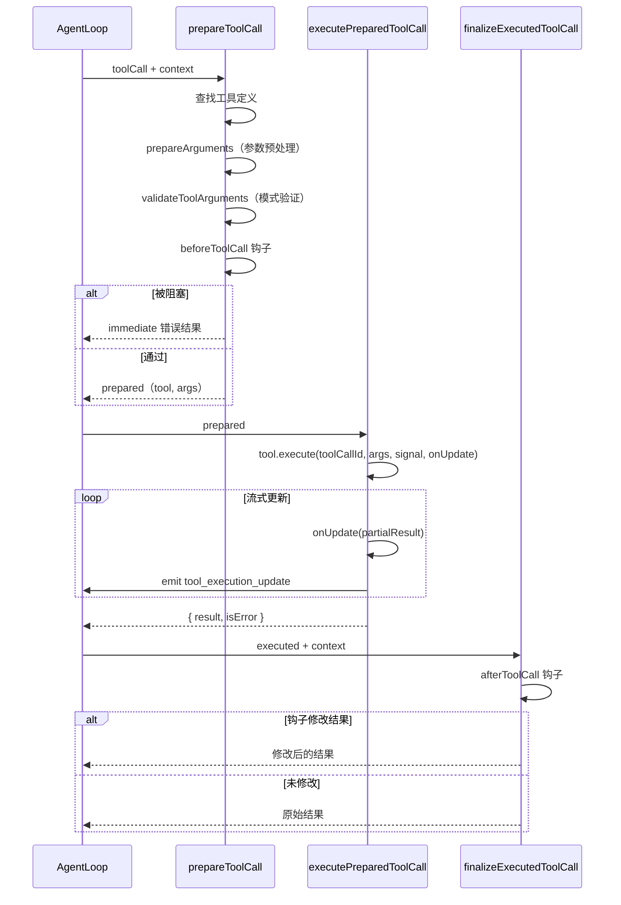

# Pi Agent Harness 设计文档

## 差分渲染设计

TUI 层采用差分渲染策略，只更新终端中实际变化的行，以达到 60fps 的流畅体验。

### 渲染流程



### 关键优化点

| 优化 | 实现 |
|------|------|
| 行级差分 | 逐行比较 `previousLines` 与 `newLines`，只重绘变化的行 |
| Kitty 图像处理 | 追踪图像 ID，变更行中的图像先删除再重绘 |
| 同步输出 | 使用 `ESC[?2026h/l`（Synchronized Output）包裹整个帧，避免撕裂 |
| 光标定位 | 追踪硬件光标位置，使用相对移动（`ESC[nA/B`）而非绝对定位 |
| 宽度溢出保护 | 每行渲染后验证 `visibleWidth <= terminalWidth`，超限则崩溃并写调试日志 |
| 收缩清理 | `clearOnShrink` 选项控制内容收缩时是否清屏（默认关闭） |

### 叠加层（Overlay）系统

```typescript
// 叠加层支持锚点定位、百分比尺寸、边距
interface OverlayOptions {
  width?: number | `${number}%`;
  minWidth?: number;
  maxHeight?: number | `${number}%`;
  anchor?: "center" | "top-left" | ...;
  offsetX?: number;
  offsetY?: number;
  row?: number | `${number}%`;
  col?: number | `${number}%`;
  margin?: Margin | number;
  visible?: (w, h) => boolean;
  nonCapturing?: boolean;
}
```

叠加层按 `focusOrder` 排序渲染，后渲染的覆盖先渲染的。支持焦点管理和键盘捕获。

## 会话树与压缩

### 会话树设计

会话历史以**树形结构**存储（非线性），支持：

- **分支**：从任意节点创建新分支
- **导航**：在树中任意节点间跳转
- **压缩**：将旧历史总结为摘要，释放上下文窗口
- **分支摘要**：导航时生成目标分支的摘要



### 压缩算法

1. **准备阶段** (`prepareCompaction`)
   - 找到上一次压缩的边界
   - 根据 `keepRecentTokens` 计算切割点
   - 确保切割点在有效的消息边界（不切断 toolCall/toolResult 对）

2. **切割点选择** (`findCutPoint`)
   - 从最新消息向前累加 token 估算
   - 达到 `keepRecentTokens` 后寻找最近的合法切割点
   - 优先选择 `user` 消息作为切割点
   - 如切割点落在回合中间，标记为 `isSplitTurn`

3. **摘要生成** (`generateSummary`)
   - 使用结构化提示词生成对话摘要
   - 包含：Goal、Constraints、Progress、Key Decisions、Next Steps、Critical Context
   - 支持增量更新（基于 previousSummary）

4. **分裂回合处理**
   - 如切割点将回合分裂，单独总结被截断的前缀部分
   - 前缀摘要使用专门的 `TURN_PREFIX_SUMMARIZATION_PROMPT`

### 压缩阈值

```typescript
interface CompactionSettings {
  enabled: boolean;        // 是否启用自动压缩
  reserveTokens: number;   // 为摘要输出预留的 token（默认 16384）
  keepRecentTokens: number; // 保留的最近上下文 token（默认 20000）
}
```

自动压缩触发条件：`contextTokens > contextWindow - reserveTokens`

## 队列模式

Agent 支持两种队列模式，分别控制 steering 和 follow-up 消息的消费策略：

### `all` 模式

```typescript
// 一次性消费队列中所有消息
drain(): AgentMessage[] {
  const drained = this.messages.slice();
  this.messages = [];
  return drained;
}
```

- 适合：批量注入多条消息
- 行为：当前回合结束后，所有 queued 消息一次性注入上下文

### `one-at-a-time` 模式（默认）

```typescript
// 每次只消费最老的一条消息
drain(): AgentMessage[] {
  const first = this.messages[0];
  if (!first) return [];
  this.messages = this.messages.slice(1);
  return [first];
}
```

- 适合：逐步引导 Agent，每条消息触发一个独立回合
- 行为：当前回合结束后，只注入最老的一条消息，剩余消息留到下一轮

### 使用场景

| 模式 | 场景 |
|------|------|
| `all` | 用户快速输入多条消息，希望一次性处理 |
| `one-at-a-time` | 需要逐步观察 Agent 对每条消息的响应 |

## 工具执行流水线

工具执行分为三个阶段：**准备 → 执行 → 收尾**



### 并行 vs 顺序执行

| 模式 | 行为 |
|------|------|
| `parallel`（默认） | 所有工具准备完成后，非 `sequential` 工具并发执行 |
| `sequential` | 每个工具依次准备、执行、收尾 |

工具可单独声明 `executionMode: "sequential"`，即使全局为 `parallel`，该工具也会顺序执行。

### 终止信号

当一批工具的所有结果都设置 `terminate: true` 时，Agent 在 tool 结果注入后停止，不再发起新的 LLM 调用。

## 扩展系统设计

### 加载机制

扩展通过 **jiti**（TypeScript 运行时加载器）动态加载：

```typescript
// 扩展是标准的 TypeScript 模块
export default function myExtension(pi: ExtensionAPI) {
  pi.on("session_start", (event, ctx) => {
    // 扩展逻辑
  });

  pi.registerTool({
    name: "my_tool",
    // ...
  });
}
```

### 虚拟模块

扩展可以通过 `pi.registerProvider()` 注册自定义 Provider，无需修改核心代码：

```typescript
pi.registerProvider("my-proxy", {
  baseUrl: "https://proxy.example.com",
  api: "anthropic-messages",
  models: [...],
});
```

### 扩展生命周期

```mermaid
graph TD
    A[启动] --> B[发现扩展文件]
    B --> C[jiti 加载 TS 模块]
    C --> D[调用扩展工厂函数]
    D --> E[注册事件处理器]
    D --> F[注册工具/命令/快捷键]
    D --> G[注册 Provider]
    E --> H[运行时事件分发]
    F --> H
    G --> H
    H --> I[/reload]
    I --> J[emit session_shutdown]
    J --> K[卸载旧扩展]
    K --> B
```

### 扩展隔离

- 每个扩展有独立的 `sourceInfo`，用于错误追踪
- Provider 注册按 `extensionPath` 隔离，卸载时可精确清理
- 扩展状态通过 `ExtensionRuntimeState.assertActive()` 检测是否过期

## 懒加载 Provider 设计

为优化启动性能和树摇（tree-shaking），所有 Provider 采用**懒加载**策略：

```typescript
// 注册时只创建代理函数
function createLazyStream(loadModule) {
  return (model, context, options) => {
    const outer = new AssistantMessageEventStream();

    loadModule()
      .then((module) => {
        const inner = module.stream(model, context, options);
        forwardStream(outer, inner);
      })
      .catch((error) => {
        outer.push({ type: "error", reason: "error", error: createErrorMessage(model, error) });
        outer.end();
      });

    return outer;
  };
}
```

### 加载策略

| Provider | 加载方式 |
|---------|---------|
| Anthropic | `import("./anthropic.ts")` |
| OpenAI (3 个) | `import("./openai-*.ts")` |
| Google (2 个) | `import("./google*.ts")` |
| Mistral | `import("./mistral.ts")` |
| Azure | `import("./azure-openai-responses.ts")` |
| Bedrock | `importNodeOnlyProvider("./amazon-bedrock.ts")`（Node 专用） |

### 单例缓存

每个 Provider 模块的 Promise 被缓存，确保同一 Provider 的多次调用只加载一次：

```typescript
let anthropicProviderModulePromise: Promise<...> | undefined;

function loadAnthropicProviderModule() {
  anthropicProviderModulePromise ||= import("./anthropic.ts").then(...);
  return anthropicProviderModulePromise;
}
```

### Bedrock 特殊处理

Bedrock 依赖 AWS SDK（Node 专用），使用 `importNodeOnlyProvider` 在运行时动态导入，浏览器环境不会加载。

## EventStream 设计

`EventStream<T, R>` 是一个通用异步事件流，用于解耦事件生产者和消费者：

```typescript
class EventStream<T, R> implements AsyncIterable<T> {
  push(event: T): void;      // 生产者推送事件
  end(result?: R): void;     // 结束流
  result(): Promise<R>;      // 获取最终结果
  [Symbol.asyncIterator](): AsyncIterator<T>; // 消费者异步迭代
}
```

### 工作原理

- 内部维护一个事件队列 `queue` 和一个等待者列表 `waiting`
- `push()` 时，如有等待中的消费者，直接交付；否则入队
- `end()` 时，通知所有等待者流已结束
- 消费者通过 `for await...of` 异步迭代获取事件

### AssistantMessageEventStream

专用的事件流子类，用于 LLM 流式响应：

```typescript
class AssistantMessageEventStream extends EventStream<AssistantMessageEvent, AssistantMessage> {
  constructor() {
    super(
      (event) => event.type === "done" || event.type === "error",
      (event) => event.type === "done" ? event.message : event.error
    );
  }
}
```

流事件类型：

| 事件 | 说明 |
|------|------|
| `start` | 流开始，携带初始 partial message |
| `text_start` / `text_delta` / `text_end` | 文本块流式更新 |
| `thinking_start` / `thinking_delta` / `thinking_end` | 思考块流式更新 |
| `toolcall_start` / `toolcall_delta` / `toolcall_end` | 工具调用流式更新 |
| `done` | 流正常结束 |
| `error` | 流异常结束 |
