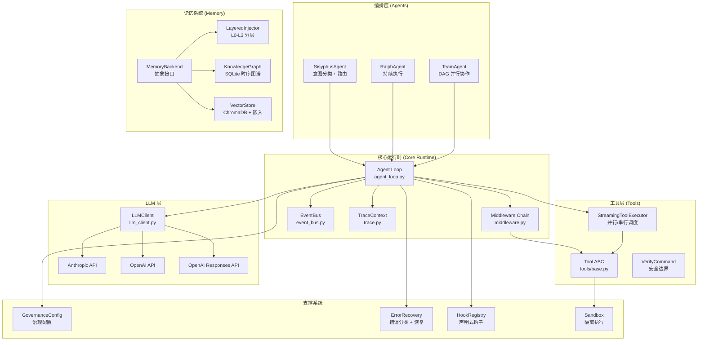
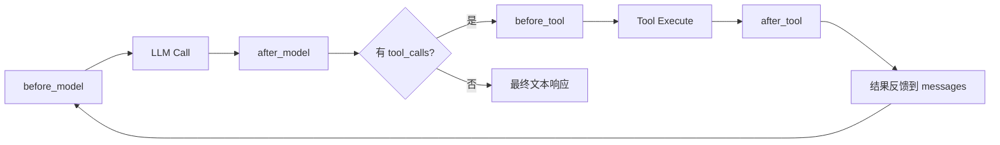
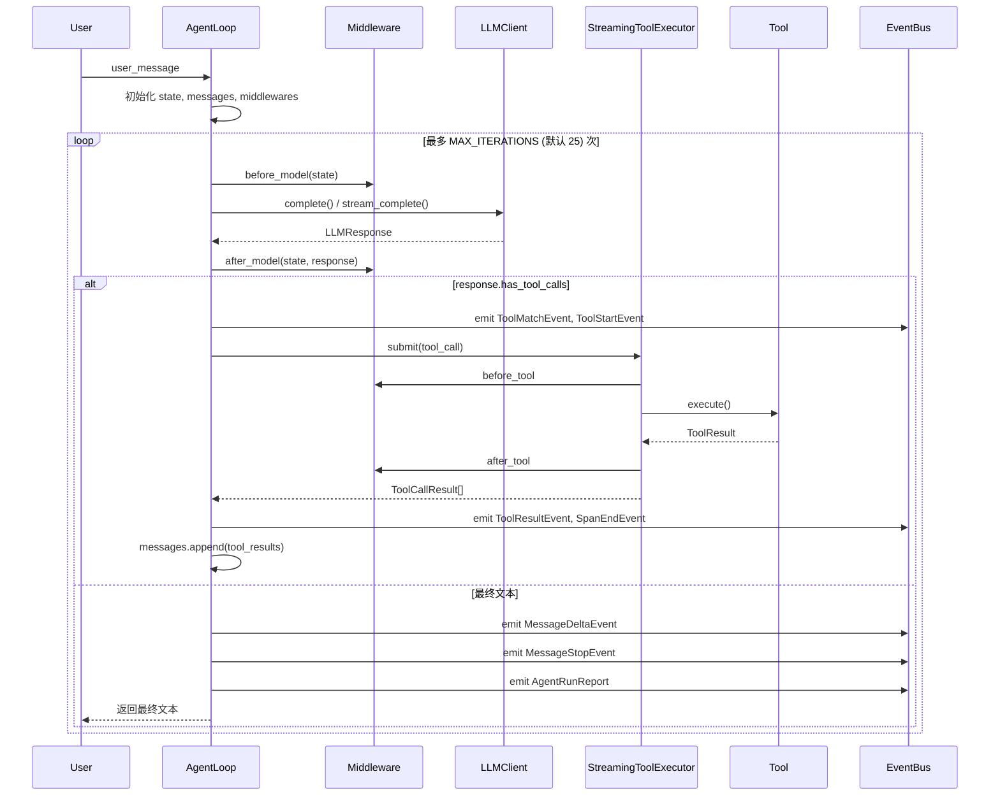
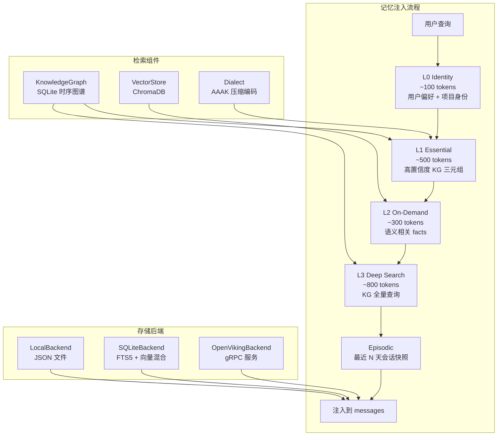
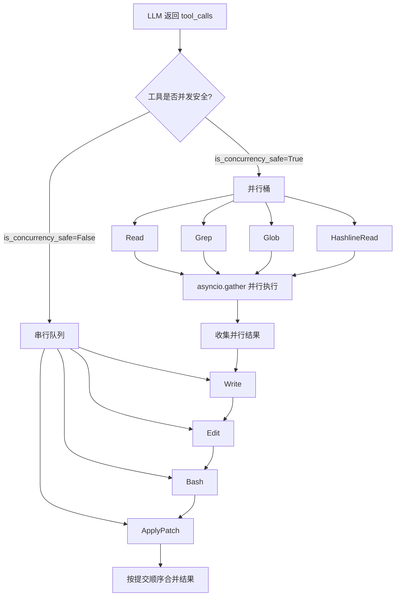
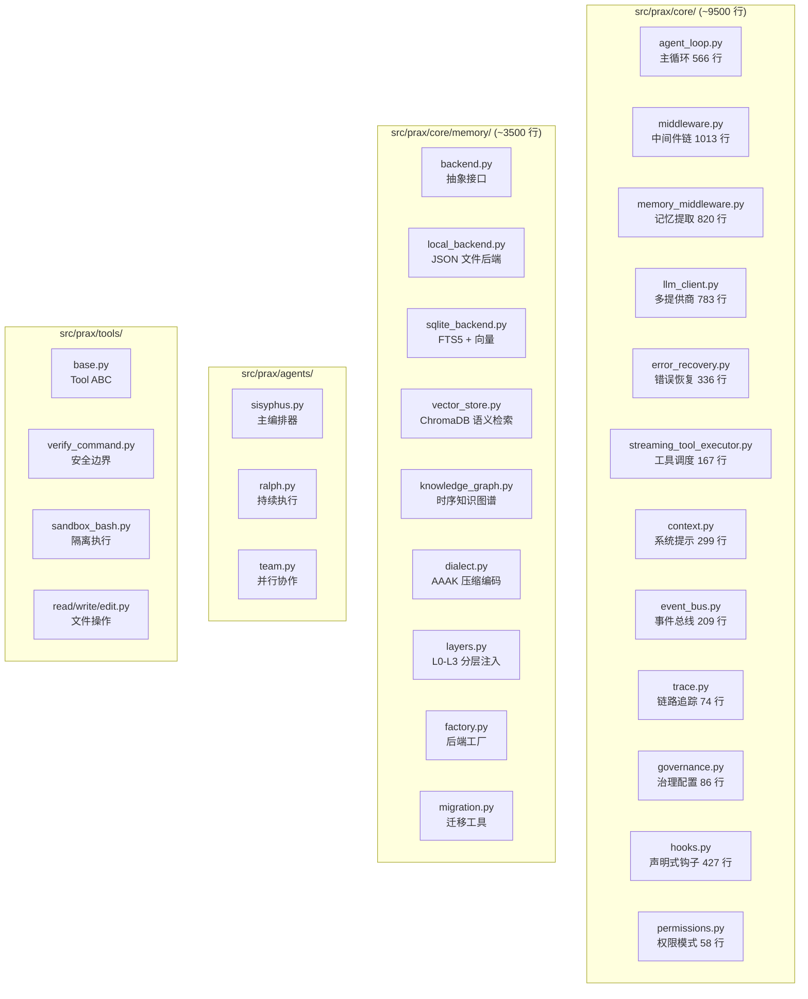

# Prax Agent 架构文档

## 1. 整体架构概览



---

## 2. 中间件管道 (Middleware Pipeline)

Prax 采用 Deep Agents 风格的中间件模式，每个中间件可在 4 个钩子点介入：



### 优先级体系

| 优先级常量 | 值 | 中间件 | 职责 |
|-----------|-----|--------|------|
| `PRIORITY_GUARD` | 10 | PermissionMiddleware, LoopDetectionMiddleware | 安全/循环检测 |
| `PRIORITY_CACHE` | 20 | PromptCacheMiddleware | 缓存优化 |
| `PRIORITY_INJECT` | 50 | ContextInjectMiddleware, MemoryExtractionMiddleware | 上下文注入 |
| `PRIORITY_EXTRACT` | 90 | MemoryExtractionMiddleware | 信息提取 |
| `PRIORITY_EVAL` | 95 | QualityGateMiddleware, EvaluatorMiddleware | 评估/质量门 |

### 核心中间件一览

```mermaid
graph LR
    subgraph "执行顺序 (数值越小越先)"
        direction TB
        CT[ChangeTracker<br/>priority=5]
        PM[PermissionMiddleware<br/>priority=10]
        LD[LoopDetectionMiddleware<br/>priority=10]
        PCM[PromptCacheMiddleware<br/>priority=20]
        CIM[ContextInjectMiddleware<br/>priority=50]
        TR[TodoReminderMiddleware<br/>priority=100]
        RBM[RunBoundaryReminderMiddleware<br/>priority=55]
        VG[VerificationGuidanceMiddleware<br/>priority=60]
        DRG[DesignRestorationGuardMiddleware<br/>priority=62]
        MFM[ModelFallbackMiddleware<br/>priority=100]
        MEM[MemoryExtractionMiddleware<br/>priority=100]
        HM[HookMiddleware<br/>priority=100]
        QGM[QualityGateMiddleware<br/>priority=95]
        EM[EvaluatorMiddleware<br/>priority=95]
    end
```



---

## 3. Agent Loop 执行流程



### 关键控制参数

| 参数 | 默认值 | 说明 |
|------|--------|------|
| `MAX_ITERATIONS` | 25 | 最大迭代次数，防止无限循环 |
| `MAX_CONSECUTIVE_FAILURES` | 3 | 连续 LLM 失败触发熔断 |
| `effective_budget` | governance 配置 | Token 预算上限 |

---

## 4. 记忆子系统架构 (5 层)



### 各层职责

| 层级 | Token 预算 | 数据来源 | 触发时机 |
|------|-----------|---------|---------|
| L0 Identity | ~100 | MemoryStore.workContext / topOfMind | 每次对话 |
| L1 Essential | ~500 | KnowledgeGraph 高置信度三元组 | 每次对话 |
| L2 On-Demand | ~300 | VectorStore 语义检索 | 每次对话，基于查询 |
| L3 Deep Search | ~800 | KnowledgeGraph 实体查询 | L2 无结果时 |
| Episodic | 动态 | `.prax/sessions/*-facts.json` | 每次会话首次 |

---

## 5. 工具执行流 (并行 vs 串行)



### 并发安全标记

工具基类通过 `is_concurrency_safe: bool` 标记是否可并行：

| 并发安全 | 工具 |
|---------|------|
| Yes | Read, Glob, Grep, HashlineRead, WebFetch, WebSearch |
| No | Write, Edit, Bash, SandboxBash, ApplyPatch, MultiEdit |

---

## 6. 组件映射



---

## 7. 数据流总结

```
用户输入
  → SisyphusAgent 意图分类 (research/implement/diagnose/refactor)
    → 路由决策: direct / ralph / team
      → AgentLoop.run_agent_loop()
        → Middleware.before_model() [按优先级排序]
          → LLMClient.complete() / .stream_complete()
            → Middleware.after_model()
              → 有 tool_calls?
                → StreamingToolExecutor 并行/串行调度
                  → Middleware.before_tool() → Tool.execute() → Middleware.after_tool()
                → 结果追加到 messages
              → 无 tool_calls → 最终文本响应
        → EventBus 全程发射事件
        → TraceContext 记录 span 层级
        → GovernanceConfig 控制预算与迭代上限
```
