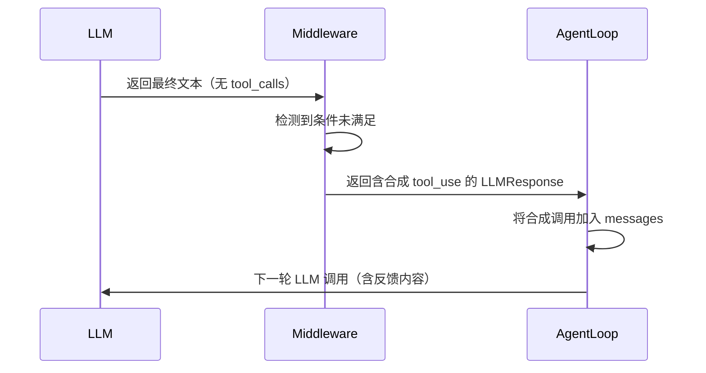
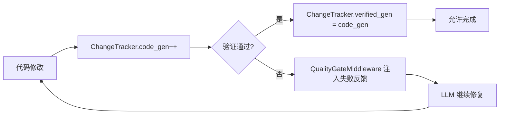

# Prax Agent 设计决策文档

## 1. 中间件优先级系统设计

### 决策

采用数值优先级（越小越先）而非固定顺序的管道模式。

### 理由

- **可扩展性**: 新中间件无需修改现有代码，只需选择合适的优先级值
- **可组合性**: 同一优先级的中间件按注册顺序执行
- **可调试性**: 优先级数值直接反映执行顺序

### 标准优先级层级

```
PRIORITY_GUARD = 10    → 安全/循环检测（必须在最前面）
PRIORITY_CACHE = 20    → 缓存优化（影响 LLM 调用参数）
PRIORITY_INJECT = 50   → 上下文注入（在 LLM 前准备消息）
PRIORITY_EXTRACT = 90  → 信息提取（在响应后处理）
PRIORITY_EVAL = 95     → 评估/质量门（最后检查）
```

### 关键设计: ChangeTracker 作为 priority=5

ChangeTracker 的优先级低于所有其他中间件（priority=5），确保在 `before_tool`/`after_tool` 之前完成状态更新。这样 `VerificationGuidanceMiddleware`（priority=60）读取 `state.metadata["change_tracker"]` 时，看到的是最新状态。

---

## 2. 合成工具调用模式 (Synthetic Tool Calls)

### 模式描述

当中间件需要强制 Agent Loop 继续执行（而非让 LLM 结束对话）时，构造一个伪工具调用响应，让 LLM 在下一轮将其作为工具结果处理。

### 应用场景

| 中间件 | 合成工具名 | 目的 |
|--------|----------|------|
| `QualityGateMiddleware` | `__completion_check__` | 代码修改后未验证，阻止完成 |
| `EvaluatorMiddleware` | `__evaluator_feedback__` | 评估标准未满足，要求修正 |
| `DesignRestorationGuardMiddleware` | `__design_restoration_guard__` | 截图验证未完成，阻止完成 |

### 工作流程



### 为什么不用直接修改 messages

合成工具调用让 LLM "看到"一个工具使用/结果对，这比直接注入系统消息更符合 LLM 的训练分布，模型更容易理解这是一个需要响应的"任务未完成"信号。

---

## 3. 共享状态模式 (Single Writer)

### 问题

多个中间件需要跟踪"代码是否被修改"、"最近一次验证是否通过"等状态。如果每个中间件维护自己的计数器，会导致：
- `CODE_MODIFYING_TOOLS` 集合在不同中间件间不一致
- "什么是验证尝试"的启发式规则漂移
- 状态竞争和重复计数

### 解决方案: ChangeTracker 作为单一写入者

```python
class ChangeTracker(AgentMiddleware):
    priority: int = 5  # 最早执行

    async def after_tool(self, state, tool_call, tool, result):
        tracker = _get_tracker(state)  # 从 metadata 读取

        if tool_call.name in CODE_MODIFYING_TOOLS and not result.is_error:
            tracker["code_gen"] += 1

        if _is_verify_attempt(tool_call):
            if result.is_error:
                tracker["last_verify_ok"] = False
                tracker["last_verify_error"] = self._trim(result.content)
            else:
                tracker["last_verify_ok"] = True
                tracker["last_verify_error"] = None
                tracker["verified_gen"] = tracker["code_gen"]
```

### 读取者

- `VerificationGuidanceMiddleware`: 读取验证状态注入指导消息
- `QualityGateMiddleware`: 读取 `code_gen` vs `verified_gen` 判断是否允许完成
- `DesignRestorationGuardMiddleware`: 读取代码变更状态

### 关键不变式

> 只有 ChangeTracker 写入 `state.metadata["change_tracker"]`，所有其他中间件只读。

---

## 4. 记忆分层设计 (L0-L3 + Episodic)

### 设计目标

在有限的上下文窗口内，注入最相关、最有价值的记忆信息。

### 四层架构

```
L0 Identity   (~100 tokens)
  └─ 用户偏好、项目身份、高置信度 preference facts
  └─ 来源: MemoryStore.workContext / topOfMind
  └─ 更新频率: 低

L1 Essential  (~500 tokens)
  └─ 高置信度知识图谱三元组 (confidence >= 0.9)
  └─ 来源: KnowledgeGraph.get_top_triples()
  └─ 压缩: AAAK Dialect 编码
  └─ 更新频率: 中

L2 On-Demand  (~300 tokens)
  └─ 与当前查询语义相关的事实
  └─ 来源: VectorStore.query() 余弦相似度检索
  └─ 更新频率: 每次查询

L3 Deep Search (~800 tokens)
  └─ 知识图谱全量实体查询（L2 无结果时回退）
  └─ 来源: KnowledgeGraph.query_entity()
  └─ 更新频率: 按需
```

### Episodic Memory

- 存储: `.prax/sessions/{YYYY-MM-DD}-facts.json`
- 内容: 当日高置信度 facts + 用户-助手对话摘要
- 注入: 每个会话首次调用时加载最近 N 天（默认 3 天）

### Token 预算控制

```python
L0_BUDGET = 100
L1_BUDGET = 500
L2_BUDGET = 300
L3_BUDGET = 800
```

每层通过 `_truncate_to_budget()` 按行截断，确保总 token 不超过预算。

### CJK 感知

```python
def _estimate_tokens(text: str) -> int:
    cjk_chars = len(_CJK_RE.findall(text))
    non_cjk = _CJK_RE.sub(' ', text)
    en_words = len(non_cjk.split())
    return max(1, int(cjk_chars * 1.5 + en_words * 1.3))
```

中文字符按 1.5 tokens/字，英文单词按 1.3 tokens/词估算。

---

## 5. 知识图谱与时序有效性

### 数据模型

```sql
-- 实体表
CREATE TABLE entities (
    id TEXT PRIMARY KEY,
    name TEXT NOT NULL,
    type TEXT DEFAULT 'unknown',
    properties TEXT DEFAULT '{}',
    created_at TEXT DEFAULT CURRENT_TIMESTAMP
);

-- 三元组表（含时序）
CREATE TABLE triples (
    id TEXT PRIMARY KEY,
    subject TEXT NOT NULL,
    predicate TEXT NOT NULL,
    object TEXT NOT NULL,
    valid_from TEXT,          -- 生效时间
    valid_to TEXT,            -- 失效时间（NULL 表示当前有效）
    confidence REAL DEFAULT 1.0,
    source TEXT,
    extracted_at TEXT DEFAULT CURRENT_TIMESTAMP
);
```

### 时序操作

```python
# 添加三元组（当前有效）
kg.add_triple("user", "prefers", "Chinese language")

# 查询特定时间点的状态
kg.query_entity("user", as_of="2026-01-15")

# 使三元组失效（不删除，标记 valid_to）
kg.invalidate("user", "uses", "old_framework", ended="2026-03-01")

# 查看实体时间线
kg.timeline("user")
```

### 为什么不用删除而是标记失效

1. **可审计**: 保留知识演变历史
2. **可恢复**: 误操作可撤销
3. **时序查询**: 支持"在 2025 年 Q4 时项目使用什么技术栈"这类问题

---

## 6. AAAK Dialect 压缩编码

### 设计目标

将知识图谱三元组压缩为 LLM 可直接阅读的紧凑格式，无需解码器。

### 编码规则

```
原始: user prefers Chinese language
编码: USR|prefers|CHN_LNG

原始: project uses SQLite
编码: PRJ|uses|SQLT
```

### 实体编码算法

```python
def _make_code(name: str, max_len: int = 8) -> str:
    # CJK: 取前 2 字或每段首字
    # 英文单字: 保留原样（<=4 字母）或去元音
    # 英文多词: 每词取前 3 字母，下划线连接
```

### L1 注入格式

```
CODES:CHN_LNG=Chinese language,PRJ=project,SQLT=SQLite
USR|prefers|CHN_LNG
PRJ|uses|SQLT
```

编码表随压缩内容一起注入，LLM 可在同一上下文中理解编码含义。

---

## 7. Sandbox 抽象与自动检测

### 后端选择策略

```
1. 显式 backend 参数
2. PRAX_SANDBOX_BACKEND 环境变量
3. Docker 可用 → DockerSandbox
4. PRAX_SANDBOX_POLICY=fail_closed → 报错
5. 否则 → LocalSandbox（回退）
```

### 为什么默认回退到 LocalSandbox

- 开发环境通常没有 Docker
- 首次用户不应看到红色警告
- 关心安全的操作者可设置 `PRAX_SANDBOX_POLICY=fail_closed`

---

## 8. 错误恢复系统 (7 类型 × 7 动作)

### 错误分类

```python
class ErrorType(str, Enum):
    TOOL_ERROR = "tool_error"           # 工具执行失败
    MODEL_ERROR = "model_error"         # LLM API 失败
    TIMEOUT = "timeout"                 # 超时
    PERMISSION_DENIED = "permission"    # 权限拒绝
    RESOURCE_EXHAUSTED = "resource"     # 资源耗尽
    PARSE_ERROR = "parse_error"         # 解析失败
    UNKNOWN = "unknown"                 # 未知
```

### 恢复动作

```python
class RecoveryAction(str, Enum):
    RETRY_SAME = "retry_same"           # 简单重试
    SWITCH_TOOL = "switch_tool"         # 切换工具/方法
    UPGRADE_MODEL = "upgrade_model"     # 升级模型
    REDUCE_SCOPE = "reduce_scope"       # 缩小范围
    SKIP_ITEM = "skip_item"             # 跳过当前项
    WAIT_AND_RETRY = "wait_and_retry"   # 退避后重试
    ABORT = "abort"                     # 终止
```

### 分类 → 恢复映射

| 错误类型 | 首次恢复 | 重试耗尽后 |
|---------|---------|-----------|
| TOOL_ERROR | SWITCH_TOOL | ABORT |
| MODEL_ERROR (瞬态) | WAIT_AND_RETRY | UPGRADE_MODEL |
| TIMEOUT | REDUCE_SCOPE | ABORT |
| PERMISSION_DENIED | SKIP_ITEM | ABORT |
| RESOURCE_EXHAUSTED | REDUCE_SCOPE | ABORT |
| PARSE_ERROR | RETRY_SAME | ABORT |
| UNKNOWN (瞬态) | RETRY_SAME | SKIP_ITEM |

### ErrorTracker

跨迭代跟踪错误模式：
- 同一工具失败 3 次以上 → 永久跳过（黑名单）
- 同一错误类型累积 → 升级恢复策略
- 主导错误类型检测 → 指导整体策略调整

---

## 9. 验证优先安全边界 (VerifyCommand)

### 设计哲学

> 代码修改后必须通过验证才能认为完成。

### VerifyCommandTool 限制

```python
_ALLOWED_PROGRAMS = {"pytest", "python", "python3", "npm", "pnpm", "cargo", "go"}
_DISALLOWED_TOKENS = {"&&", "||", ";", "|", ">", ">>", "<"}
```

- 仅允许白名单中的验证命令
- 禁止 shell 组合符（防止注入）
- 使用 `asyncio.create_subprocess_exec` 而非 shell（无 shell 解释）

### 与 SandboxBash 的区别

| 特性 | VerifyCommand | SandboxBash |
|------|--------------|-------------|
| 命令范围 | 白名单验证命令 | 任意命令 |
| 执行方式 | `subprocess_exec`（无 shell） | `subprocess_shell` |
| 权限级别 | REVIEW | DANGEROUS |
| 用途 | 验证修复 | 通用执行 |

### 质量门闭环



---

## 10. 意图驱动模型路由

### SisyphusAgent 路由逻辑

```python
SISYPHUS_ROUTING_PROMPT = """
分析任务并选择执行策略:
1. "ralph" — 多步骤待办，需要持续执行
2. "team" — 可拆分为 2-6 个独立并行子任务
3. "direct" — 简单问答或单步任务
"""
```

### ModelFallbackMiddleware 意图映射

```python
_INTENT_MODEL_MAP = {
    "debugging": "gpt-5.4",           # 调试需要强推理
    "deep_research": "gpt-5.4",       # 深度研究需要强推理
    "architecture": "claude-opus-4-7", # 架构设计需要长上下文
    "chinese_content": "glm-4-flash",  # 中文内容用国产模型
    "quick_tasks": "glm-4-flash",      # 快速任务用轻量模型
}
```

### 回退链

```
claude-opus-4-7 → gpt-5.4 → glm-4-flash
```

当当前模型持续出错时，按回退链升级模型。

---

## 11. 其他关键设计决策

### Claude Format 作为 Lingua Franca

- 内部统一使用 Claude message format
- 与 OpenAI API 交互时自动双向转换
- 好处: 单一格式减少复杂度，Claude format 对工具调用表达更自然

### Skills 作为 Markdown + YAML Frontmatter

- 技能定义存储在 `.prax/skills/` 或 `src/prax/skills/`
- 格式: YAML frontmatter + Markdown 内容
- 按 task_type 过滤注入，避免无关技能污染上下文

### Hot-Reload Governance (mtime 缓存)

```python
_gov_cache: dict[str, tuple[float, GovernanceConfig]] = {}

@classmethod
def from_file_with_reload(cls, path: str) -> "GovernanceConfig":
    # 比较文件 mtime，变更时重新加载
```

治理配置可在运行时修改并立即生效，无需重启。

### 权限模式

```python
class PermissionMode(str, Enum):
    READ_ONLY = "read-only"              # 仅只读工具
    WORKSPACE_WRITE = "workspace-write"  # 工作区内读写
    DANGER_FULL_ACCESS = "danger-full-access"  # 全部权限
```

工具通过 `PermissionLevel` (SAFE/REVIEW/DANGEROUS) 声明自身风险等级，与当前模式比较决定是否授权。
